# 系統流程說明文件

> **Binance Spot Trading Bot** — 完整交易決策流程與架構說明

## 目錄

1. [系統架構總覽](#系統架構總覽)
2. [元件關係圖](#元件關係圖)
3. [主交易迴圈](#主交易迴圈)
4. [單一交易對處理流程](#單一交易對處理流程)
5. [多時間框架分析 (MTF)](#多時間框架分析-mtf)
6. [LLM 決策引擎](#llm-決策引擎)
7. [風控管理與持倉週期](#風控管理與持倉週期)
8. [訂單執行與停損停利](#訂單執行與停損停利)
9. [合約交易流程](#合約交易流程)
10. [資料流與 Supabase 整合](#資料流與-supabase-整合)
11. [配置熱重載](#配置熱重載)
12. [借貸監控 (Loan Guard)](#借貸監控-loan-guard)

---

## 系統架構總覽

系統由三大部分組成：Python Bot（核心交易引擎）、Supabase（資料中介）、Vue 3 Frontend（監控介面）。Bot 不暴露任何 HTTP 端口，所有資料交換透過 Supabase PostgreSQL + Realtime。

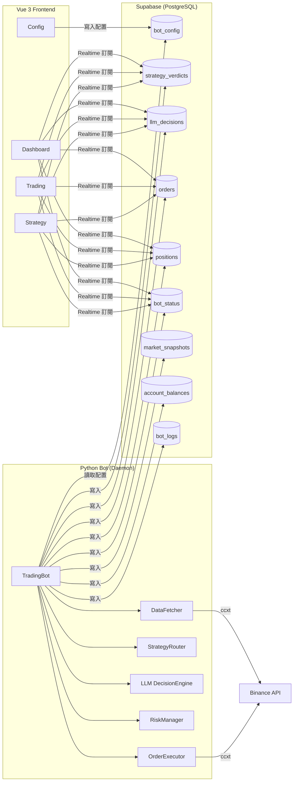

---

## 元件關係圖

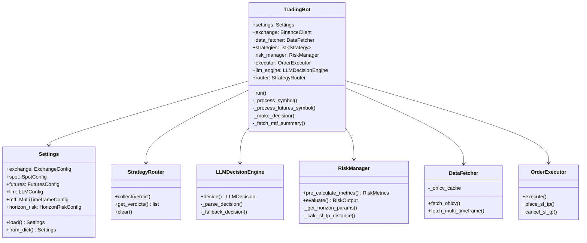

---

## 主交易迴圈

Bot 啟動後進入無限迴圈，每 `check_interval_seconds` 秒（預設 60 秒）執行一輪分析。

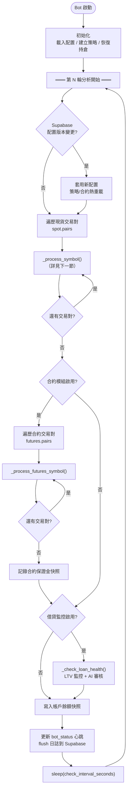

### 初始化流程

```
TradingBot.__init__()
├── Settings.load()                # 載入 .env + config.yaml
├── SupabaseWriter()               # 建立 Supabase 連線
├── load_config()                  # 從 Supabase 讀取線上配置（覆蓋本地）
├── BinanceClient()                # ccxt 交易所連線
├── DataFetcher()                  # K 線資料抓取器
├── _create_all_strategies()       # 建立 OHLCV + OrderFlow 策略
├── RiskManager(spot, horizon_risk) # 風控（含 Horizon 配置）
├── OrderExecutor()                # 訂單執行器
├── _restore_positions()           # 從 Supabase 恢復持倉
├── StrategyRouter()               # 策略結論收集器
├── LLMDecisionEngine()            # Claude LLM 決策引擎
└── _init_futures()                # 合約模組（若啟用）
```

---

## 單一交易對處理流程

`_process_symbol()` 是現貨交易的核心方法，包含 7 個步驟：

```mermaid
flowchart TD
    START(["_process_symbol(symbol)"]) --> STEP1

    %% Step 1: 抓取 K 線
    STEP1["① 抓取 K 線 (OHLCV)"]
    STEP1 --> CHECK_DATA{K 線充足?}
    CHECK_DATA -- "不足" --> SKIP_RETURN([跳過此交易對])
    CHECK_DATA -- "充足" --> GET_PRICE["取得現價 + 寫入 market_snapshot"]

    %% Step 2: 停損停利
    GET_PRICE --> STEP2["② 停損停利檢查"]
    STEP2 --> LIVE_OCO{Live + 有 OCO?}
    LIVE_OCO -- "是" --> SYNC_OCO[檢查交易所 OCO 是否成交]
    LIVE_OCO -- "否" --> PAPER_SLTP
    SYNC_OCO --> OCO_FILLED{已成交?}
    OCO_FILLED -- "是" --> SKIP_RETURN
    OCO_FILLED -- "否" --> PAPER_SLTP
    PAPER_SLTP["Paper 模式: 輪詢價格判斷 SL/TP"]
    PAPER_SLTP --> SLTP_HIT{觸發?}
    SLTP_HIT -- "是" --> EXEC_SELL_SLTP["執行賣出 (SL/TP)"]
    EXEC_SELL_SLTP --> SKIP_RETURN
    SLTP_HIT -- "否" --> STEP3

    %% Step 3: 策略結論收集
    STEP3["③ 收集策略結論"]
    STEP3 --> OF_FEED["3a. 訂單流資料收集<br/>(每輪都執行)"]
    OF_FEED --> SLOT_CHECK["3b. Slot 防重複<br/>minutes_since_midnight ÷ interval_n"]
    SLOT_CHECK --> RUN_STRATS["執行各策略 generate_verdict()"]
    RUN_STRATS --> COLLECT["router.collect(verdict)<br/>寫入 strategy_verdicts 表"]
    COLLECT --> HAS_VERDICTS{有策略結論?}
    HAS_VERDICTS -- "無" --> SKIP_RETURN
    HAS_VERDICTS -- "有" --> STEP4

    %% Step 4: 風控預計算
    STEP4["④ 預計算風控指標<br/>(僅 BUY 信號)"]
    STEP4 --> RISK_PRE["計算 ATR / SL / TP / R:R<br/>Fibonacci / 支撐壓力 / 布林帶"]

    %% Step 5: MTF
    RISK_PRE --> STEP5["⑤ 多時間框架摘要<br/>_fetch_mtf_summary()"]
    STEP5 --> MTF_ENABLED{MTF 啟用?}
    MTF_ENABLED -- "是" --> FETCH_MTF["抓取 1d/4h/1h/15m K 線<br/>計算各 TF 技術指標<br/>生成 Markdown 表格"]
    MTF_ENABLED -- "否" --> STEP6
    FETCH_MTF --> STEP6

    %% Step 6: LLM 決策
    STEP6["⑥ LLM 決策"]
    STEP6 --> LLM_CALL["Claude LLM 分析<br/>策略結論 + 倉位 + 風控 + MTF"]
    LLM_CALL --> LLM_OUT{LLM 結果}
    LLM_OUT -- "HOLD" --> HOLD_RETURN(["HOLD 不動作"])
    LLM_OUT -- "信心 < 門檻" --> HOLD_RETURN
    LLM_OUT -- "BUY/SELL" --> STEP7

    %% Step 7: 風控 + 執行
    STEP7["⑦ 風控評估 + 執行"]
    STEP7 --> IS_BUY{BUY or SELL?}
    IS_BUY -- "BUY" --> RISK_EVAL["風控評估<br/>Horizon 倉位 / SL / TP<br/>LLM size_pct 取保守值"]
    RISK_EVAL --> APPROVED{通過?}
    APPROVED -- "否" --> RISK_REJECT(["風控拒絕"])
    APPROVED -- "是" --> EXEC_BUY["執行買入 + 掛 SL/TP<br/>寫入 orders + positions"]
    IS_BUY -- "SELL" --> EXEC_SELL["執行賣出<br/>取消 SL/TP 掛單<br/>計算 PnL"]
```

---

## 多時間框架分析 (MTF)

MTF 模組在 LLM 決策前額外抓取多個時間框架的 K 線，計算技術指標摘要。

### 配置

```python
@dataclass(frozen=True)
class MultiTimeframeConfig:
    enabled: bool = True
    timeframes: tuple[str, ...] = ("1d", "4h", "1h", "15m")
    candle_limit: int = 50
    cache_ttl_seconds: int = 300   # 5 分鐘 TTL 快取
```

### 流程

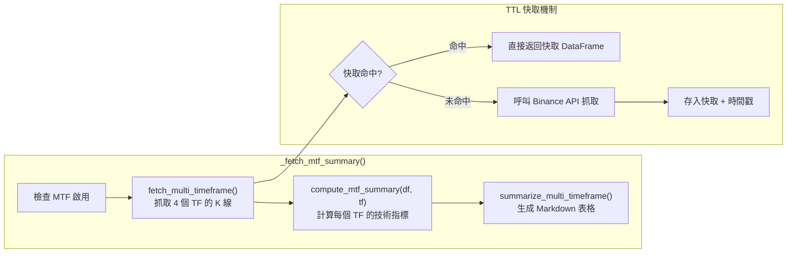

### TimeframeSummary 計算項目

每個時間框架計算以下指標，封裝為 `TimeframeSummary` dataclass：

| 指標 | 計算方式 | 用途 |
|------|---------|------|
| `trend` | SMA20 vs SMA50 斜率 | 趨勢方向 (bullish/bearish/neutral) |
| `rsi_14` | RSI(14) | 超買/超賣判斷 |
| `macd_direction` | MACD histogram 方向 | 動量方向 |
| `bb_pct_b` | Bollinger %B | 價格在布林帶中的位置 |
| `volume_trend` | 近期 vs 歷史成交量比 | 量能變化 |
| `atr_pct` | ATR(14) / close × 100 | 波動幅度 |

### 輸出範例

```markdown
## 多時間框架分析

| 時間框架 | 趨勢 | RSI | MACD方向 | BB%B | 成交量 | 波幅(ATR%) |
|----------|------|-----|---------|------|--------|-----------|
| 1d       | 看漲 | 55  | 多頭    | 0.63 | 放量   | 2.35%     |
| 4h       | 盤整 | 48  | 中性    | 0.45 | 持平   | 1.82%     |
| 1h       | 看跌 | 32  | 空頭    | 0.15 | 縮量   | 1.20%     |
| 15m      | 看漲 | 28(超賣) | 多頭 | 0.08 | 放量 | 0.85%     |

**多框架偏多**: 2/4 時間框架看漲。
```

---

## LLM 決策引擎

所有非 HOLD 信號強制經過 Claude LLM 審核。LLM 扮演策略仲裁者，綜合所有資訊做最終判斷。

### 決策流程

```mermaid
flowchart TD
    INPUT["輸入:<br/>策略結論 + 倉位狀態<br/>+ 風控指標 + MTF 摘要"]
    INPUT --> SUMMARIZE["摘要化<br/>summarize_verdicts()<br/>summarize_portfolio()<br/>summarize_risk_metrics()<br/>summarize_multi_timeframe()"]
    SUMMARIZE --> BUILD_PROMPT["build_decision_prompt()<br/>組建完整提示詞"]
    BUILD_PROMPT --> CALL_LLM["Claude CLI 呼叫<br/>claude -p --model sonnet"]
    CALL_LLM --> PARSE["解析 JSON 回傳"]
    PARSE --> VALIDATE

    VALIDATE{驗證決策}
    VALIDATE --> CHECK_OVERRIDE{LLM 方向<br/>有策略支持?}
    CHECK_OVERRIDE -- "有" --> ACCEPT[接受決策]
    CHECK_OVERRIDE -- "無 + 信心≥0.7" --> OVERRIDE["有條件覆蓋<br/>倉位縮半"]
    CHECK_OVERRIDE -- "無 + 信心<0.7" --> HOLD_FALLBACK["強制 HOLD"]

    CALL_LLM -- "失敗" --> HOLD_FAIL["HOLD<br/>(LLM 失敗不 fallback 執行)"]

    subgraph "LLM 回傳格式"
        JSON["```json<br/>{<br/>  action: BUY/SELL/HOLD<br/>  confidence: 0.75<br/>  stop_loss_pct: 0.03<br/>  take_profit_pct: 0.06<br/>  position_size_pct: 0.02<br/>  horizon: medium<br/>  reasoning: ...<br/>}<br/>```"]
    end
```

### LLM 提示詞結構

```
┌─────────────────────────────────┐
│ SYSTEM_PROMPT                   │  角色定義 + 決策原則 + 風控紅線
│  - 多時間框架共振指引            │  + 持倉週期判斷標準
│  - Horizon SL/TP/倉位表          │  + JSON 回傳格式
├─────────────────────────────────┤
│ 交易對: BTC/USDT                │
│ 現價: 95000.00 USDT             │
├─────────────────────────────────┤
│ 倉位狀態                        │  可用餘額 / 持倉 / 每日 PnL
├─────────────────────────────────┤
│ 多時間框架分析                   │  1d/4h/1h/15m 技術指標表格
├─────────────────────────────────┤
│ 策略結論                        │  各策略的信號 + 信心 + 推理
├─────────────────────────────────┤
│ 風控指標                        │  SL/TP/R:R + Fib + 支撐壓力 + BB
└─────────────────────────────────┘
```

---

## 風控管理與持倉週期

### Horizon 動態風控

LLM 回傳 `horizon`（short/medium/long），風控根據此值調整所有參數。

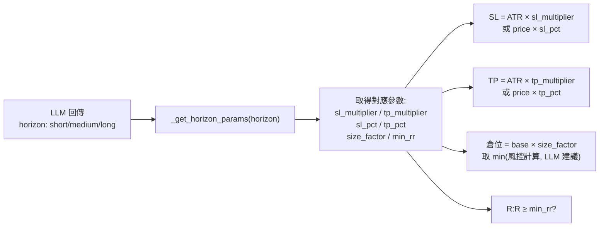

### 三種持倉週期參數

| 參數 | Short (短線) | Medium (中線) | Long (長線) |
|------|-------------|--------------|------------|
| SL 倍率 (ATR×) | 1.0 | 1.5 | 2.5 |
| TP 倍率 (ATR×) | 2.0 | 3.0 | 5.0 |
| SL 固定 % | 2% | 3% | 5% |
| TP 固定 % | 4% | 6% | 15% |
| 倉位因子 | 1.2 (較大) | 1.0 (標準) | 0.6 (較小) |
| 最低 R:R | 1.5 | 2.0 | 2.5 |

### 風控評估流程

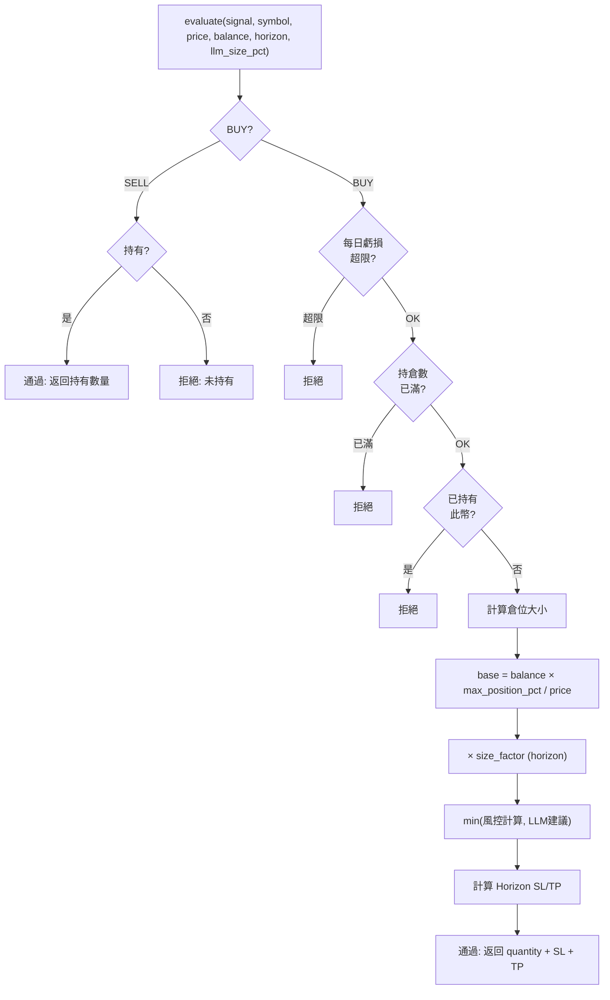

---

## 訂單執行與停損停利

### 買入執行流程

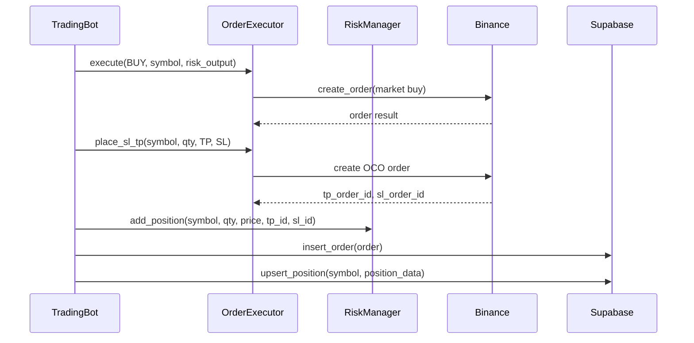

### 停損停利機制

| 模式 | 機制 | 說明 |
|------|------|------|
| Live | OCO 掛單 | 交易所自動執行，Bot 輪詢檢查成交狀態 |
| Paper | 輪詢比價 | 每輪 cycle 用現價比對 SL/TP 價位 |

---

## 合約交易流程

合約交易支援 **做多 (BUY)** 和 **做空 (SHORT)**，信號轉換邏輯如下：

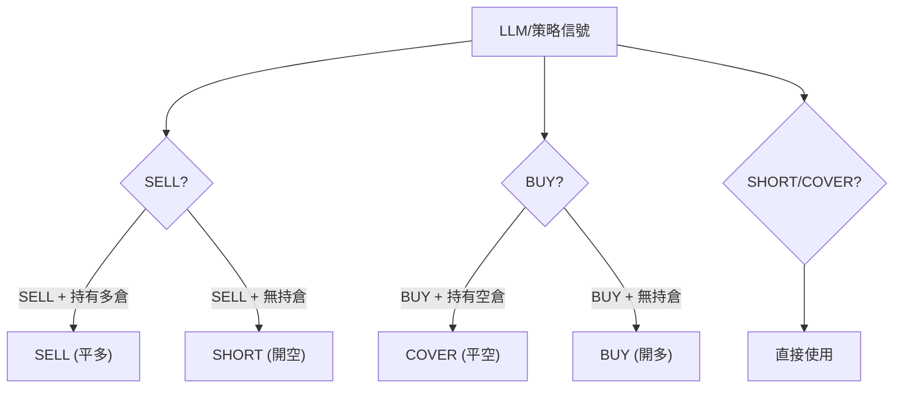

### 合約額外風控

- **保證金比率** > 80%：禁止開新倉
- **清算價距離** < 5%：強制考慮平倉
- **資金費率** > 0.1%（方向不利）：謹慎開倉
- 同一幣對不可同時持有多倉和空倉

---

## 資料流與 Supabase 整合

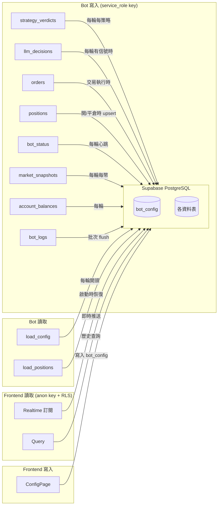

### 日誌批次寫入

Bot 日誌使用自定義 `SupabaseLogHandler`，緩衝到 50 條或 30 秒後批次寫入 Supabase，避免頻繁 API 呼叫。每輪 cycle 結束時強制 `flush_logs()`。

---

## 配置熱重載

Bot 每輪 cycle 開頭從 Supabase `bot_config` 表讀取最新配置。前端 ConfigPage 修改配置後寫入新版本，Bot 下一輪自動偵測版本變更並套用。

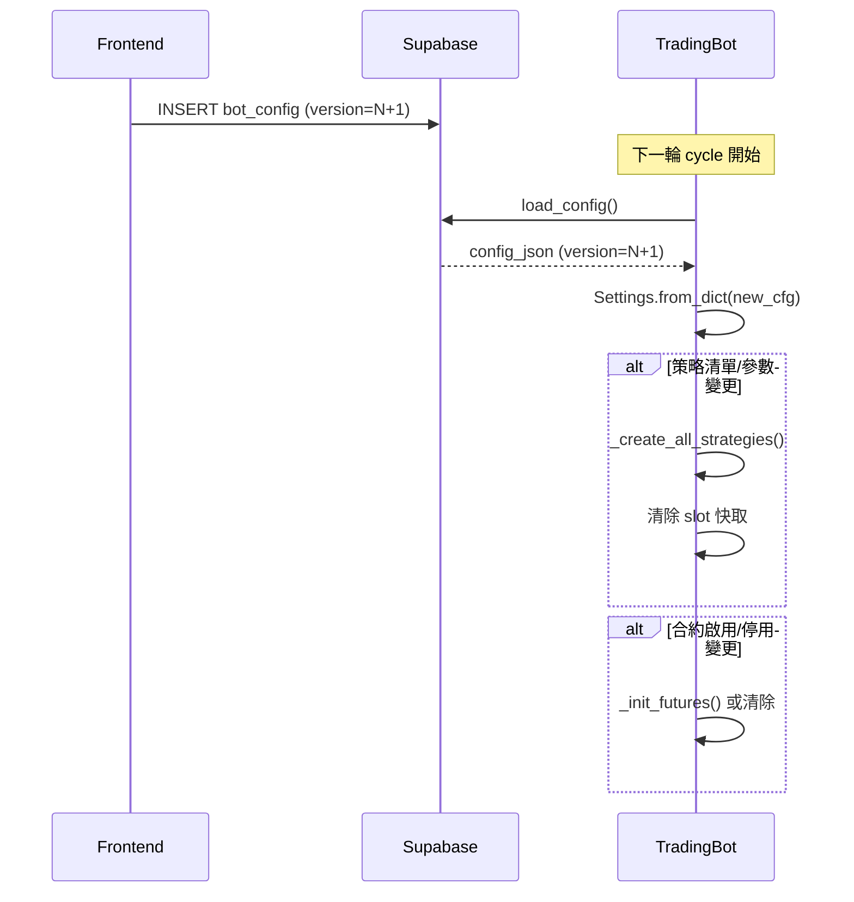

### 可熱重載項目

| 項目 | 說明 |
|------|------|
| 交易對 (pairs) | 下一輪立即生效 |
| 策略清單/參數 | 重建策略實例 + 清除 slot |
| 風控參數 | SL/TP/倉位/每日虧損限制 |
| LLM 啟停 | 下一輪決策方式切換 |
| MTF 啟停 | 多時間框架分析開關 |
| Horizon 參數 | SL/TP 倍率、倉位因子 |
| 合約模組 | 啟用/停用/槓桿/交易對 |
| 借貸監控 | 啟用/停用/LTV 閾值 |

---

## 借貸監控 (Loan Guard)

每輪 cycle 結束後檢查借貸 LTV，4 層判定自動再平衡。

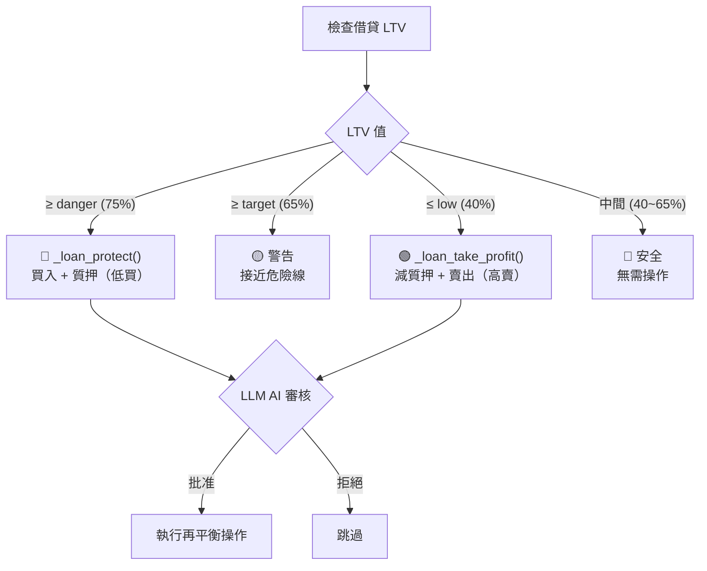

---

## 策略 Slot 防重複機制

為避免同一時間區間內策略重複執行，使用時間 slot 機制：

```
slot = minutes_since_midnight ÷ interval_n

例如 interval_n=60（每小時）:
  09:00~09:59 → slot 9
  10:00~10:59 → slot 10

同一 slot 內只執行一次策略，slot 變化即觸發。
```

---

## 完整單輪 Cycle 時序圖

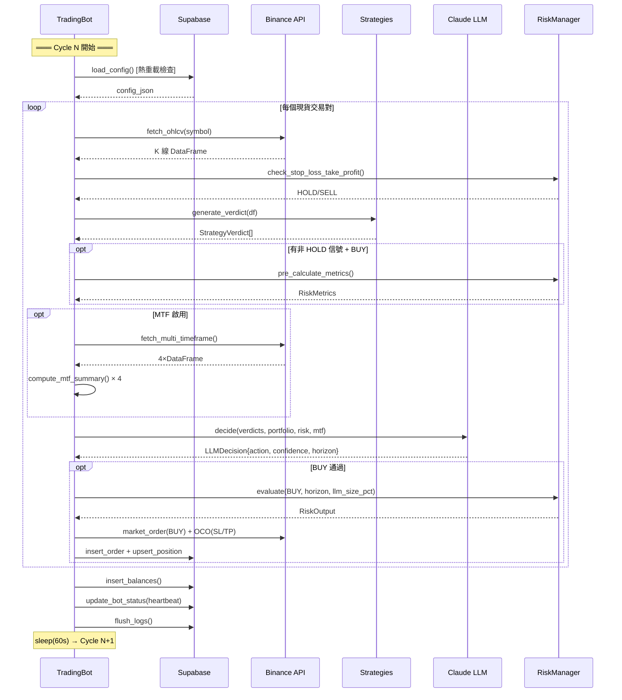

---

## 檔案索引

| 檔案 | 職責 |
|------|------|
| `bot/app.py` | 主交易迴圈、流程編排 |
| `bot/config/settings.py` | 配置管理（frozen dataclass） |
| `bot/data/fetcher.py` | K 線抓取 + TTL 快取 |
| `bot/strategy/router.py` | 策略結論收集器 |
| `bot/strategy/base.py` | 策略基類 |
| `bot/strategy/*.py` | 各策略實現 |
| `bot/llm/decision_engine.py` | LLM 決策引擎 |
| `bot/llm/prompts.py` | 提示詞模板 |
| `bot/llm/summarizer.py` | 資料摘要化 |
| `bot/llm/schemas.py` | LLMDecision / PortfolioState |
| `bot/risk/manager.py` | 現貨風控（Horizon 動態） |
| `bot/risk/futures_manager.py` | 合約風控 |
| `bot/risk/metrics.py` | RiskMetrics dataclass |
| `bot/execution/executor.py` | 現貨訂單執行 |
| `bot/execution/futures_executor.py` | 合約訂單執行 |
| `bot/utils/indicators.py` | 技術指標計算 |
| `bot/db/supabase_client.py` | Supabase 寫入層 |
| `bot/exchange/binance_client.py` | ccxt 現貨封裝 |
| `bot/exchange/futures_client.py` | ccxt 合約封裝 |
